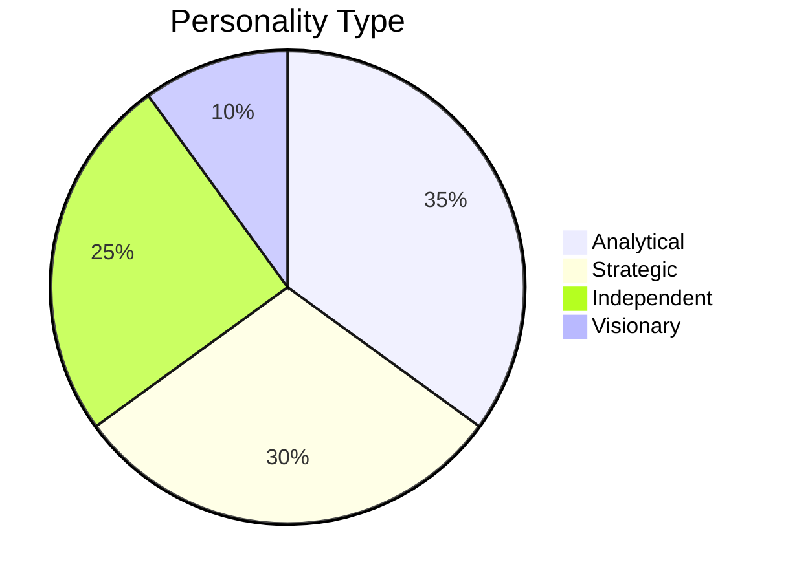
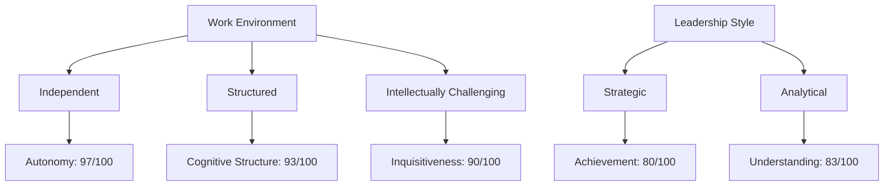

# Agrannya Singh (19) - INTJ-T Personality Profile

## Core Personality Traits



## Key Strengths

### Cognitive Abilities
- **Intellectual Efficiency**: 67/100
- **Inquisitiveness**: 90/100
- **Aesthetic Appreciation**: 97/100
- **Cognitive Structure**: 93/100
- **Understanding**: 83/100

### Work Style
- **Achievement**: 80/100
- **Endurance**: 80/100
- **Diligence**: 73/100
- **Perfectionism**: 80/100
- **Deliberativeness**: 87/100

### Independence
- **Autonomy**: 97/100
- **Self-Reliance**: 77/100
- **Individualism**: 80/100
- **Breadth of Interest**: 97/100

## Personality Dimensions

### HEXACO Model
```mermaid
radarChart
    title HEXACO Personality Dimensions
    axis Honesty-Humility, Emotionality, Extraversion, Agreeableness, Conscientiousness, Openness
    "Scores" : [40, 40, 20, 30, 80, 90]
```

### Big Five Traits
1. **Openness**: 90/100
   - Creativity: 83
   - Aesthetic Appreciation: 97
   - Unconventionality: 80

2. **Conscientiousness**: 80/100
   - Perfectionism: 80
   - Organization: 63
   - Deliberativeness: 87

3. **Extraversion**: 20/100
   - Sociability: 3
   - Social Boldness: 43
   - Liveliness: 33

4. **Agreeableness**: 30/100
   - Gentleness: 23
   - Forgiveness: 40
   - Flexibility: 10

5. **Neuroticism**: 40/100
   - Anxiety: 70
   - Stress Reaction: 73
   - Well-being: 37

## Work Style Preferences



## Learning & Development

### Cognitive Strengths
- **Analytical Thinking**: 87/100
- **Abstract Reasoning**: 90/100
- **Problem-Solving**: 85/100

### Areas for Growth
- **Social Skills**: 25/100
- **Emotional Expression**: 30/100
- **Flexibility**: 10/100

## Career Orientation

### Best Fits
1. Research & Development
2. Strategic Planning
3. Data Analysis
4. Scientific Fields
5. Technical Writing

### Work Values
- **Intellectual Challenge**: 95/100
- **Independence**: 97/100
- **Achievement**: 80/100
- **Structure**: 85/100
- **Innovation**: 90/100
HPI: Avoids trouble                     27
HPI: Self focus                         77
HPI: Impression management              60
HPI: Identity                           37
HPI: Intellectual games                 89
HPI: Empathy                            27
HPI: Likes crowds                       23
HPI: Mastery                            80
HPI: Appearance                         42
HPI: Good attachment                    60
HPI: Sensitive                          23
HPI: Calmness                           27
HPI: Entertaining                       63
HPI: No guilt                           27
HPI: No social anxiety                  37
HPI: Moralistic                         47
HPI: Trusting                           30
HPI: No somatic complaints              30
HPI: Likes parties                      23
HPI: Competitive                        73
HPI: Likes people                       3
HPI: Culture                            97
HPI: Thrill-seeking                     60
HPI: Good memory                        87
HPI: Self confidence                    50
HPI: Impulse control                    50
HPI: Education                          73
HPI: Exhibitionistic                    23
HPI: Not autonomous                     30
TCI: Work hardened                      80
TCI: Resourcefulness                    67
TCI: Eagerness of effort                60
TCI: Shyness with strangers             87
TCI: Self-forgetful                     67
TCI: Spiritual acceptance               50
TCI: Attachment                         7
TCI: Ambitious                          77
TCI: Impulsiveness                      10
TCI: Idealistic                         50
TCI: Compassion                         37
TCI: Social acceptance                  20
TCI: Helpfulness                        20
TCI: Disorderliness                     60
TCI: Exploratory Excitability           63
TCI: Sentimentality                     10
TCI: Empathy                            23
TCI: Warm communication                 13
TCI: Dependence                         20
TCI: Fatigability & asthenia            57
TCI: Perfectionist                      77
TCI: Transpersonal identification       47
TCI: Self-acceptance                    40
TCI: Worry & pessimism                  67
TCI: Enlightened                        50
TCI: Enlightened second nature          43
TCI: Fear of uncertainty                53
TCI: Extravagance                       43
TCI: Purposefulness                     40
TCI: Responsibility                     33
TCI: Pure-hearted conscience            23
NEO PI-R: Straightforwardness           27
NEO PI-R: Ideas                         87
NEO PI-R: Dutifulness                   80
NEO PI-R: Actions                       60
NEO PI-R: Self-Discipline               67
NEO PI-R: Warmth                        20
NEO PI-R: Impulsiveness                 53
NEO PI-R: Competence                    63
NEO PI-R: Altruism                      43
NEO PI-R: Anxiety                       70
NEO PI-R: Achievement Striving          70
NEO PI-R: Compliance                    33
NEO PI-R: Values                        60
NEO PI-R: Activity                      60
NEO PI-R: Excitement-Seeking            43
NEO PI-R: Order                         67
NEO PI-R: Modesty                       63
NEO PI-R: Aesthetics                    93
NEO PI-R: Assertiveness                 63
NEO PI-R: Deliberation                  70
NEO PI-R: Tender-Mindedness             47
NEO PI-R: Positive Emotions             40
NEO PI-R: Gregariousness                3
NEO PI-R: Vulnerability                 63
NEO PI-R: Feelings                      37
NEO PI-R: Fantasy                       73
NEO PI-R: Angry Hostility               73
NEO PI-R: Self-Consciousness            67
NEO PI-R: Trust                         43
NEO PI-R: Depression                    63
JPI-R: Anxiety                          70
JPI-R: Risk Taking                      47
JPI-R: Energy Level                     43
JPI-R: Cooperativeness                  30
JPI-R: Breadth of Interest              90
JPI-R: Sociability                      7
JPI-R: Traditional Values               33
JPI-R: Complexity                       60
JPI-R: Empathy                          20
JPI-R: Responsibility                   50
JPI-R: Innovation                       87
JPI-R: Organization                     63
JPI-R: Tolerance                        23
JPI-R: Social Confidence                23
JPI-R: Social Astuteness                47

b