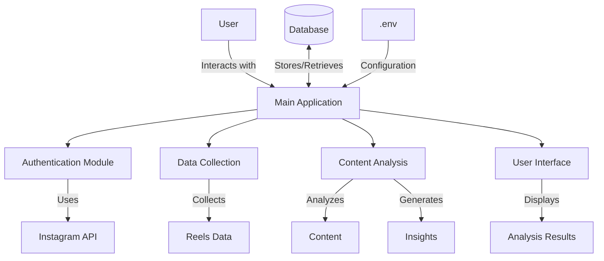
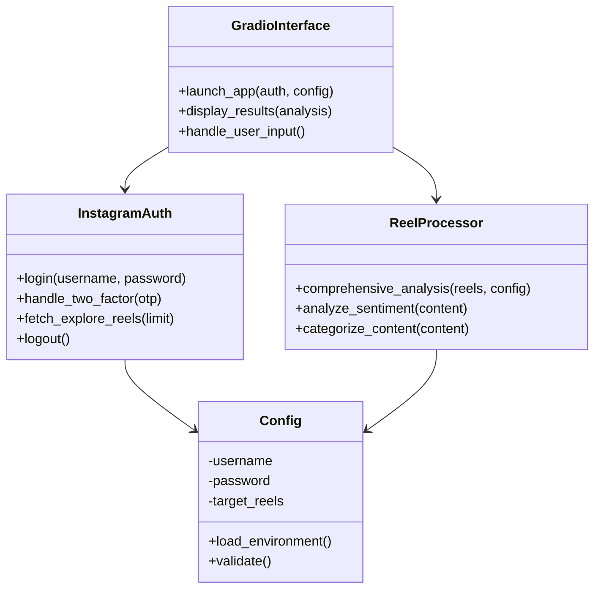
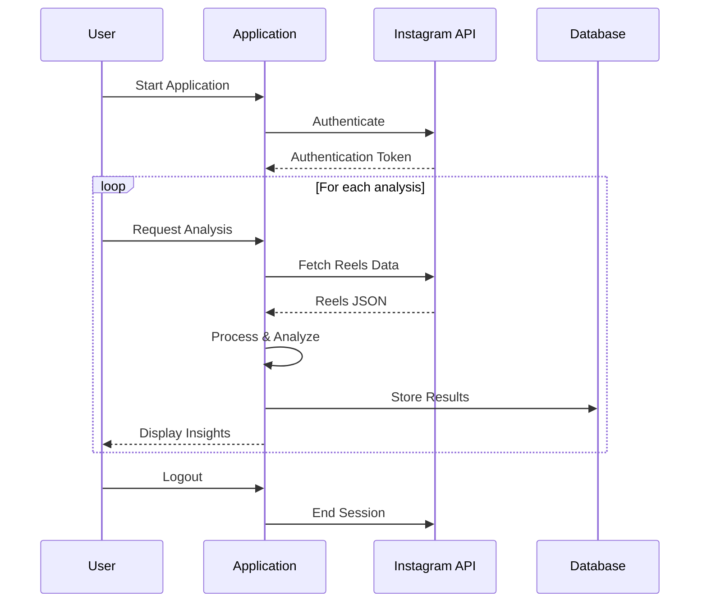
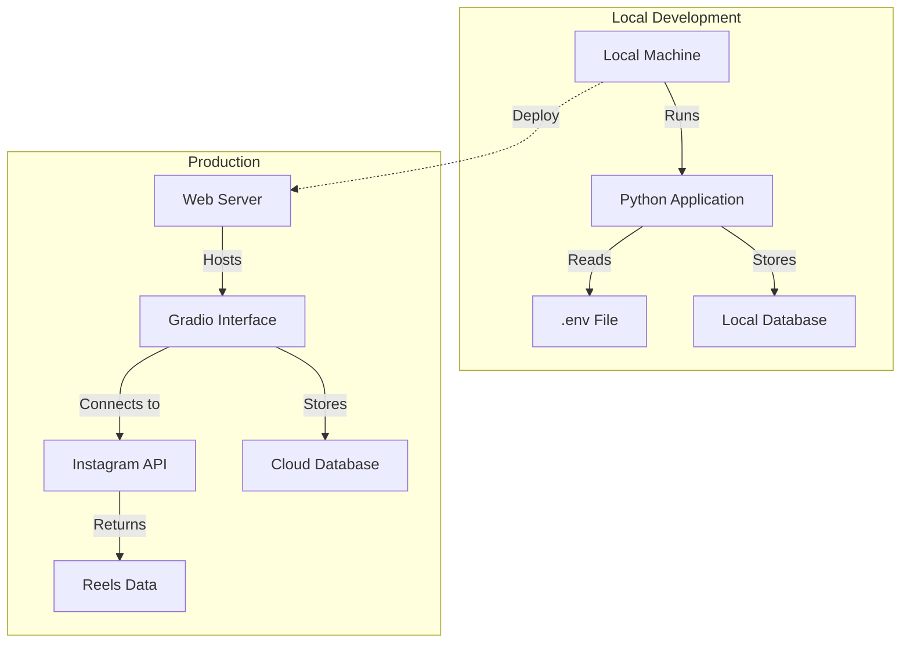
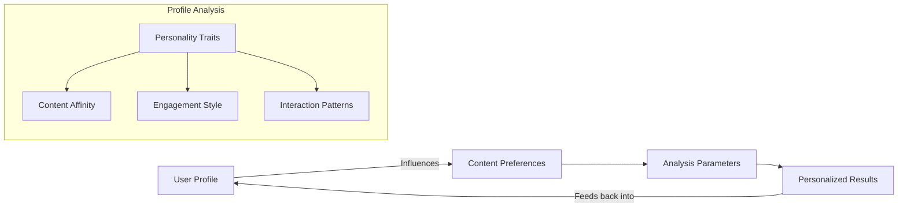
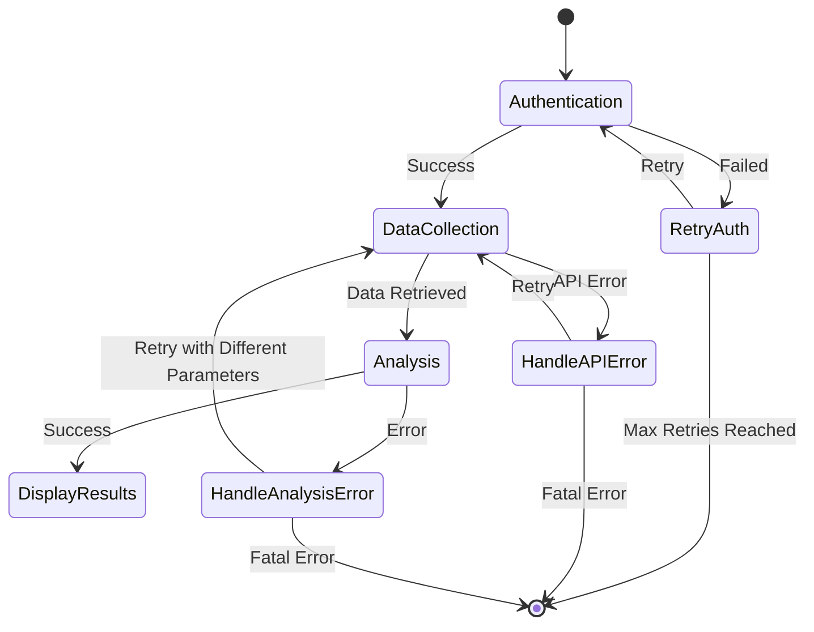
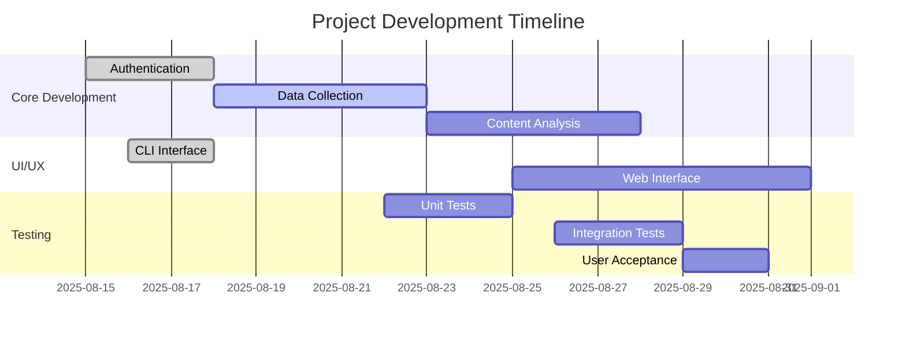

# Instagram Reels Analysis - Project Architecture

## System Overview

## Component Architecture

## Data Flow

## Deployment Architecture

## Personality Integration

## Error Handling

## Development Workflow

